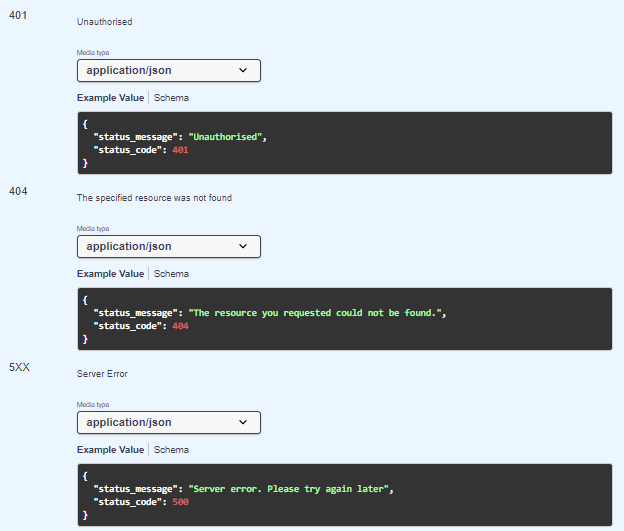

## Improving the API - Schemas and Examples

The existing API that we have specified gives no information about the data schemas used in both requests and responses. For example. looking at the API, all you can tell for the ``/api/movies/`` path is that it returns a list of movies. There's no information about the content. 

+ does it return XML, JSON, text? 
+ What properties does a Movie have?
+ Is there an example content for a response/request 

From your Movie React app, you already have example Movie data. You can use this to formally define a schema and examples in the components/example section of the API specification and then and corporate  them in various parameter descriptions, request and response body descriptions, objects and properties.

This can be accomplished by defining **schemas** and **examples**.

**We will use the same schema adopted in the MovieDB application used in the previous Labs**.

## Standard HTTP Responses: 404, 5XX, 401 
You will notice there is a lot of repetition in the responses, particularly for error codes(404, 401 and 500 HTTP statuses). We can define generic responses for these status codes. You can do this in the **components** section:

- Add the following to the bottom of the API specification:

~~~yaml
components:
  schemas:
    NotFound:
      type: object
      properties:
        status_message: 
          type: string
          example: "The resource you requested could not be found."
        status_code:
          type: integer
          example: 404
          
    Unauthorised:
      type: object
      properties:
        status_message: 
          type: string
          example: "Unauthorised"
        status_code:
          type: integer
          example: 401
          
    ServerError:
      type: object
      properties:
        status_message: 
          type: string
          example: "Server error. Please try again later"
        status_code:
          type: integer
          example: 500
~~~

+ **Inside the components property** (at the same indentation level as schemas) add the following ``responses:`` that define each of the standard "error" responses.

~~~yaml
  responses:
    NotFound:
      description: The specified resource was not found
      content:
        application/json:
          schema:
            $ref: '#/components/schemas/NotFound'
    Unauthorised:
      description: Unauthorised
      content:
        application/json:
          schema:
            $ref: '#/components/schemas/Unauthorised'
    ServerError:
      description: Server Error
      content:
        application/json:
          schema:
            $ref: '#/components/schemas/ServerError'
~~~

Once the schemas and responses are in place and validated by the editor, add a reference to the responses for the  ``404:``, ``401:`` and ``500`` for the ``get:`` method of the ``/api/movies``  

+ Go to the ``/api/movies`` path in the file and update the ``404:``, ``401:`` and ``500`` responses with the following

~~~yaml
        '401':
          $ref: '#/components/responses/Unauthorised'
          
        '404':
          $ref: '#/components/responses/NotFound'
          
        '5XX':
          $ref: '#/components/responses/ServerError'

~~~
The ``#ref`` key specifies the location of the response description.
You should see the API document update to show the example responses:

+ **For each path, replace the '401', 404' and '5XX' responses the with above code, you should be able to just copy/paste).**

## Movie Schema

The response to both **/api/movies** and **/api/movies/{id}** will return and use movie data. You will now define the schema for a movie and and example response in the component section of the document:

+ In the Swagger Editor, click on the '+' sign opposite Schemas to add a new Schema and name it "Movie"

This will create a "skeleton" Movie schema  

- Now click on **show code editor** to return to the editor and locate the Movie schema entry (should be right down the bottom).  

- Replace the ``properties:`` of the **Movie** schema with the following:

~~~yaml
      properties:
              poster_path:
                title: image-path
                type: string
              adult:
                type: boolean
              overview:
                type: string
              release_date:
                type: string
              genre_ids:
                type: array
                items:
                  type: integer
              id:
                type: integer
              original_title:
                type: string
              original_language:
                type: string
              title:
                type: string
              backdrop_path:
                title: image-path
                type: string
              popularity:
                type: number
              vote_count:
                type: integer
              video:
                type: boolean
              vote_average:
                type: number
~~~

- Once the schema is in place and validated by the editor(no red things!), find the '200' response  of the of the get: ``/api/movies/{id}`` endpoint. Add  the code indicated by the ``# ADD NEW CODE FROM HERE`` comments shown below:

~~~yaml
        '200':
          description: 'Movie details'
          content: # ADD NEW CODE  FROM HERE ON
            application/json:
              schema:
                $ref: '#/components/schemas/Movie'
        
~~~

Once validated, the Movie schema should appear in the API document on the right of the editor.

## List of Movies

You will now define a schema for the list of movies returned by the path /api/movies/. This schema will reference the **Movie** schema from the last step.

- Add the following schema, ``MovieList`` to the existing schemas in the API definition(make sure it's at the same indentation level as the ``Movie`` schema):

~~~yaml
        MovieList:
        type: object
        properties:
          page:
            type: integer
          total_pages:
            type: integer
          total_results:
            type: integer
          results:
            type: array
            items: 
              $ref: '#/components/schemas/Movie'
~~~

Notice the **results** property contains an array of movies. The ``page``,``total_pages``, and ``total_results`` can be used by apps to navigate/display large movie lists. 

- In the 200 response for the get: ``/api/movies`` endpoint, add  the code indicated by the ``# ADD NEW CODE FROM HERE`` comments shown below:

~~~yaml
        '200':
          description: 'List of Movies'
          content: # ADD NEW CODE  FROM HERE ON
            application/json:
              schema:
                 $ref: '#/components/schemas/MovieList'
~~~

Now check the API document again, you should see a specification for the 200 response for ``/api/movies``

## Movie Reviews

### Post Review Schema

We will now add schema specifications to get and post Movie Reviews:

+ In the ``schemas:`` property, create the following Movie Review schema for creating reviews:

~~~yaml
    PostMovieReview:
      type: object
      properties:
        author: 
          type: string
        content:
          type: string
~~~

Now lets specify a ``requestBody`` for the ``post:``  ``api/movies/{id}/reviews`` endpoint

- Add the following  ``requestBody:`` to the ``post:``  ``api/movies/{id}/reviews`` endpoint. It should be at the same indentation level as ``parameters``:

~~~yaml
        requestBody:
          required: true
          content:
            application/json:
              schema:
                $ref: '#/components/schemas/PostMovieReview'
~~~

### Review List Schema

We can reuse the Post Movie Review schema to return a list of movie reviews. This will include extra properties included by the API service and database including ***id, created_at, and updated_at***. You can specify the extra properties using  **allof:** 

+ Add the following Schema for returning Movie Reviews: 

~~~yaml
    MovieReviewList:
        type: object
        properties:
          page:
            type: integer
          total_pages:
            type: integer
          total_results:
            type: integer
          results:
            type: array
            items: 
              allOf:
                - $ref: '#/components/schemas/PostMovieReview'
                - type: object
                  properties:
                    id:
                      type: string
                    created_at:
                      type: string
                    updated_at:
                      type: string            
    
~~~

+ Add the schema reference to the ``/api/movie/{id}/reviews`` path for the ``200:`` response for the ``get:`` method:

~~~yaml
'200':
            description: 'Movie reviews'
            content: #ADD CODE FROM HERE ON
              application/json:
                schema:
                  $ref: '#/components/schemas/MovieReviewList'
~~~

Now check that the API document contains the updated data. 

