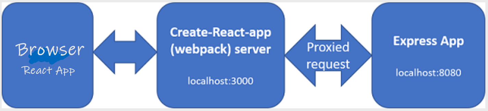

# Exercises

### 1. Genres

Implement the **GET /api/genres** endpoint. 

### 2. Refactor Common Responses

Currently, we use the same code to return 404 (not found) responses for several endpoints. We specified a common "Not Found" response in our Swagger document. Create a responses.js module that exports the standard responses that we specified in our Swagger definition and use them in the Movies Router. You should be able to update the code for each 404 response similar to the following:


## Hooking up the React App via proxying (just a little!).

Like you did with the Mock API last week, you should now be able to hook up parts of your Movie React App to the API. This step would require completion of the React lab that requests movie data from the TMDB service.

### System Architecture

We will keep using the **create-react-app** framework you were using previously. **create-react-app** provides a mechanism for working with an API server in development. We can have the development server proxy requests intended for our API server as follows:



The React app makes an API request to **localhost:3000**, the **Webpack development server**. The development server proxies that request to the API server. This will remove any Cross-Origin-Resource-Sharing (CORS) issues with the browser.
For this to work we need to launch both the MovieDB React App using the create-react-app dev server and the Express API server in order to run the app locally. We also need to get the react dev server to proxy requests to the Express API.


#### Proxy Server
To have the React development server proxy our API requests to our Express API server, we need to add the following to the **package.json file in the MovieDB React App folder from your previous labs**

```json
...
"proxy":"http://localhost:8080"
...
```

- **You must start/restart your MovieDB React app for the new proxy setting to take affect.** 

The Webpack server should now forward any request for unknown resources coming into the Webpack server though to your Express app listening on port 8080.


## Integrate the Express Movie API

Currently the MovieDB React app uses the */src/api/tmdb-api.js* to integrate the MoviesDB. We will now redirect **just the GET movies** to our local API.

+ In the ``/src/api`` folder of the React MovieDB app, edit ``tmdb-api.js`` as follows: Update the URL used in the  ``export const getMovies = ...`` statement as indicated below.

```javascript
export const getMovies = () => {
  return fetch(
    `/api/movies`   //THIS IS ALL YOU SHOULD NEED TO CHANGE
  )
    .then((res) => res.json())
    .then((json) => {
      // console.log(json)
      return json.results;
    });
};
  ....as before
```
as the ``/api/movies`` path does not exist on the Webpack server, it is proxied to ``http:/localhost:8080``,  which returns a list of movies (just four!) as before. 

Run and check the React App in the browser. You should see just the two movies in the local API so far. 


**Now, do the same for the Movie Details (as we're just using 1 move in the test data, only "Raya and the Last Dragon" will return data.)**


We will leave it there for now. In the next lab we will refactor and extend the API integration...