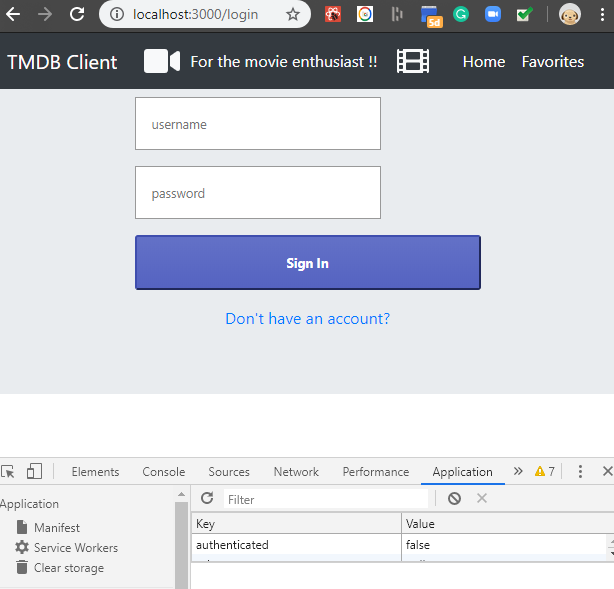
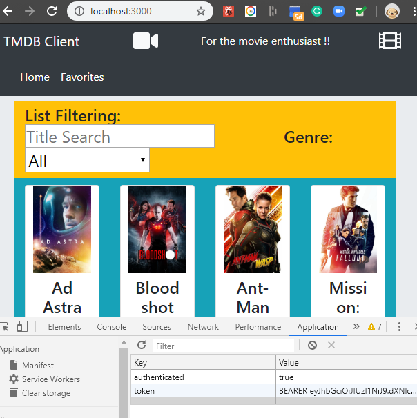

# Create a Login and Signup page

+ Have a look at the application in the browser. You will probably notice there's no movies.

~~~bash
proxy error: Could not proxy request /api/moviess from localhost:3000 to http://localhost:8080.
See https://nodejs.org/api/errors.html#errors_common_system_errors for more information (ECONNREFUSED).
~~~

This is because the react app (the client) has not retrieved a valid JSON Web Token to use the MovieDB Express API.
In the next part, we will include a Login page to allow user authentication.

**THE FOLLOWING STEPS ARE FOR THE REACT APPLICATION**


### Authentication Context

+ In the */src/contexts* folder create a file called **authContext.js** with the following content:   

```javascript
import React, { useEffect, useState , createContext , useContext} from 'react';

export const AuthContext = createContext(null);

const AuthContextProvider = (props) => {
  const prevAuth = window.localStorage.getItem('authenticated') || false;
  const prevAuthToken = window.localStorage.getItem('token') || null;
  const [authenticated, setAuthenticated] = useState(prevAuth);
  const [authToken, setAuthToken] = useState(prevAuthToken);
  
  useEffect(
    () => {
      window.localStorage.setItem('authenticated', authenticated);
      window.localStorage.setItem('token', authToken);
    },
    [authenticated, authToken]
  );
  const defaultContext = {
    authenticated,
    setAuthenticated,
    authToken,
    setAuthToken
  };
  
  return (
    <AuthContext.Provider value={defaultContext}>
      {props.children}
    </AuthContext.Provider>
  );
};

export function useAuth() {
  return useContext(AuthContext);
}

export default AuthContextProvider
```

You will use this context to keep track of the user authentication context.
Lets create a basic React page that can manage User registration and Authentication from your MovieDB App using context and state.

## Login and Signup

+ In */src/components* folder, create a folder called *loginComponents*  and add a script *index.js* with the following contents:

~~~Javascript
import styled from 'styled-components';

const Card = styled.div`
  box-sizing: border-box;
  max-width: 410px;
  margin: 0 auto;
  padding: 0 2rem;
  display: flex;
  flex-direction: column;
  align-items: center;
`;

const Form = styled.div`
  display: flex;
  flex-direction: column;
  width: 100%;
`;

const Input = styled.input`
  padding: 1rem;
  border: 1px solid #999;
  margin-bottom: 1rem;
  font-size: 0.8rem;
`;

const Button = styled.button`
  background: linear-gradient(to bottom, #6371c7, #5563c1);
  border-color: #3f4eae;
  border-radius: 3px;
  padding: 1rem;
  color: white;
  font-weight: 700;
  width: 100%;
  margin-bottom: 1rem;
  font-size: 0.8rem;
`;

const Logo = styled.img`
  width: 50%;
  margin-bottom: 1rem;
`;

const Error = styled.div`
  background-color: red;
`;


export { Form, Input, Button, Logo, Card, Error };
~~~

+ In the */src/pages/* folder add a new file called *loginPage.js* with the following contents

~~~javascript
import React, { useState} from "react";
import { Link, Redirect } from "react-router-dom";
import * as api from '../api/tmdb-api';
import { Card,  Form, Input, Button, Error } from "../components/loginComponents";
import { useAuth } from "../contexts/authContext";

function Login() {
  const context = useAuth();
  const [isError, setIsError] = useState(false);
  const [userName, setUserName] = useState("");
  const [password, setPassword] = useState("");

  function userLogin() {
    api.login( userName, password)
    .then(result => {
      if (result.success) {
        context.setAuthToken(result.token);
        context.setAuthenticated(true);
      } else {
        setIsError(true);
      }
    }).catch(e => {
      console.log(e)
      setIsError(true);
    });
  }

  
  if (context.authenticated===true) {
    return <Redirect to="/" />;
  }

  return (
    <Card>
      <Form>
        <Input
          type="username"
          value={userName}
          onChange={e => {
            setUserName(e.target.value);
          }}
          placeholder="username"
        />
        <Input
          type="password"
          value={password}
          onChange={e => {
            setPassword(e.target.value);
          }}
          placeholder="password"
        />
        <Button onClick={userLogin}>Sign In</Button>
      </Form>
      <Link to="/signup">Don't have an account?</Link>
        { isError &&<Error>The username or password provided were incorrect!</Error> }
    </Card>
  );
}

export default Login;
~~~

+ Add another file in *src/pages/* folder called *signupPage.js* with the following contents:

~~~javascript
import React, { useState} from "react";
import { Link, Redirect } from "react-router-dom";
import * as api from '../api/tmdb-api';
import { Card,  Form, Input, Button, } from "../components/loginComponents";
import { useAuth } from "../contexts/authContext";

function Signup() {
  //const [isLoggedIn, setLoggedIn] = useState(false);
  const [isError, setIsError] = useState(false);
  const [registered, setRegistered] = useState(false);
  const [userName, setUserName] = useState("");
  const [password, setPassword] = useState("");
  const [passwordAgain, setPasswordAgain] = useState("");

  function register() {
    if (password !== passwordAgain) {
        setIsError(true);
    }else{
    api.signup( userName, password)
    .then(result => {
      if (result.code===201) {
        setRegistered(true);
      } else {
        setIsError(true);
      }
    }).catch(e => {
      console.log(e)
      setIsError(true);
    });
  }}

  if (registered) {
    return <Redirect to="/" />;
  }
  return (
    <Card>
   
      <Form>
        <Input type="username"
          value={userName}
          onChange={e => {
            setUserName(e.target.value);
          }}  placeholder="username" />
        <Input type="password"
          value={password}
          onChange={e => {
            setPassword(e.target.value);
          }} placeholder="password" />
        <Input type="password"
          value={passwordAgain}
          onChange={e => {
            setPasswordAgain(e.target.value);
          }} placeholder="password again" />
        <Button onClick={register}>Sign Up</Button>
      </Form>
      <Link to="/login">Already have an account?</Link>
    </Card>
  );
}

export default Signup;
~~~

Again we import the *../api/tmdb-api.js* script to interact with the users api. We also use the *auth.js* script to manage local storage of the JWT token.

## Add the Login Page Routing and Context wrapping to App

We will now update the MovieDB app such that, if the user has not authenticated, we will present a link (in the form of a button) to the login page.

+ Open React MovieDBs */src/index.js* and add a new route for the login page.

~~~Javascript
...
import LoginPage from './pages/loginPage';
import SignupPage from './pages/signupPage';
import AuthContextProvider from './contexts/authContext'

...
    <AuthContextProvider>
      <Switch>
                ...
                <Route exact path="/login" component={LoginPage} />
                <Route path="/signup" component={SignupPage} /> />
                ...
      </Switch>
    </AuthContextProvider>
 ....
~~~  

## Protect the Home Page

Before the Home Page is rendered, check that the current user is authenticated.

+ Open */src/pages/homepage.js* and modify as shown below:

~~~javascript
import React, { useContext } from "react";
import PageTemplate from '../components/templateMovieListPage'
import {MoviesContext} from '../contexts/moviesContext'
import AddToFavoritesButton from '../components/buttons/addToFavorites'
import { useAuth } from "../contexts/authContext";
import { Redirect} from "react-router-dom";

const MovieListPage = () => {
  const context = useContext(MoviesContext);
  const userContext = useAuth();
 
  return (
    <>{(userContext.authenticated===true)?(
      <>
      <PageTemplate 
        title='All Movies'
        movies={context.movies}
        action={movie => <AddToFavoritesButton movie={movie} /> }
      />
      </>
    ):(
      <Redirect to='/login' />
    )}
    </>
  );
};

export default MovieListPage;
~~~

The above script redirects to the Login route if the user has not authenticated. 

## Test the App...


+ Now test the new login functionality. If not logged in you should see the following:




+ Authenticate using username: user1, password: test1. This should return you to the home page and the list of movies.

 

Notice the JSON web token value in the local storage.

Congratulations! You've included JWT in your app.


