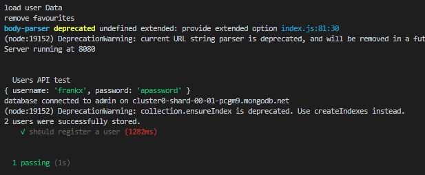

# Testing the MoviesDB API

### Create your first integration test

+ To enable us to test the Express app, we need to export the app object from *index.js* in the base folder of the project. Modify the */index.js* as follows:

```javascript
...
export const app = express(); //replaces the previous const app = express();
...
```

+ Create  new folder called */tests* in the root folder of the lab.

+ As before, create a new eslint config file in the tests folder, */tests/.eslintrc*, with the following content:

~~~json
{
    "env": {
        "mocha": true
    },
    "rules": {
       "no-unused-vars":"off"
    }
}
~~~

+ Create a new file called ``/tests/testUsersApi.js`` with the following content.

```javascript
import supertest from 'supertest';
import {
    app
} from '../index.js';
import should from 'should';

// Tests begin
describe('Users API test', function () {
    this.timeout(120000);

    // test #1: Register a User
    it('should register a user', (done) => {

        const newUser = {
            username: "frankx",
            password: "apassword"
        };

        supertest(app)
            .post('/api/users')
            .send(newUser)
            .query({
                action: 'register'
            })
            .expect('Content-type', /json/)
            .expect(201) // This is the HTTP response
            .then(res => {
                // HTTP status should be 200
                res.should.have.property('status').equal(201);
                done();
            }).catch(err => done(err));
    });
});
```
This script uses Supertest to test registering a new user using the API.

## Update package.json

+ Add a *scripts* entry in the *package.json* file for the API testing.
```json

"scripts": {
  ....
  ,
"test": "cross-env NODE_ENV=test mocha ./tests/*.js --require babel-core/register --require babel-polyfill --exit"
 }
```

The above script entry for test will set ``NODE_ENV`` to test and then run mocha against the files matching the pattern provided (i.e. ./tests/*.js). You also need to update the start script to set ``NODE_ENV`` to 'development' before starting the server.

+ Now test by running the test script:

```bash
npm run test
```

You should see something similar to the following:



## Include Mockgoose

The current test is an integration test as it requires a real, functioning database. If we want our tests to just apply to the service interface then we should remove the dependency on the (real) database. 

In our current solution, we connect to the database by importing the *db.js* module. To use a "mock" bb when testing, update the */db.js* module to use Mockgoose for testing as follows:

+ In */db.js*, import the Mockgoose package

~~~javascript
import {Mockgoose} from 'mockgoose';
...
~~~

+ In */db.js*, replace the ``mongoose.connect(process.env.mongoDB);`` statement with the following code:

 ~~~ javascript
 ...

// Connect to database
if (process.env.NODE_ENV === 'test') {
    // use mockgoose for testing
    const mockgoose=new Mockgoose(mongoose);
    mockgoose.prepareStorage().then(()=>{
      mongoose.connect(process.env.mongoDB);
    });
  } else {
    // use the real deal for everything else
    mongoose.connect(process.env.mongoDB);
  }
  
...
~~~

This code will wrap the existing Mongoose object with Mockgoose only if the ``NODE_ENV`` environment variable is set to test (i.e. we're running test cases).

+ Now test again by running the test script:

```bash
npm run test
```

This time the first test run  will take longer as Mockgoose will create a local Mongodb in memory for the test. Subsequent tests will be faster though.


## More User API tests

Now lets try to test the authenticate function of the User API.

### Setup Test Data

+ In */test/testUsersApi.js*, add the following constants just below the import statements: 

~~~javascript
... Other Imports

import userModel from '../api/users/userModel';

const testUser = {};
const invalidUser = {};
~~~

+ Add a ``before(..)`` function inside the tests description  to initialise the test data:

~~~javascript
...

// Tests begin
describe('Users API test', function () {
    this.timeout(120000);

    before((done) => {
        testUser.username = 'user2';
        testUser.password = 'test2';
        invalidUser.username = 'chancer1';
        invalidUser.password = 'bad1';
        userModel.create(testUser).then(result => done()).catch(err => done(err))
    });

...
~~~

The above vode initialises the objects used in the tests and checks the Mongoose DB connection is connected before allowing tests to kick off.

+ Add another test. This time we'll use SuperTest to authenticate an existing user already in the DB (the seed data loaded at startup):

```javascript
    it('should return a user token for valid user', (done) => {
        supertest(app)
        .post('/api/users')
        .send(testUser)
        .expect('Content-type', /json/)
        .expect(200) // This is the HTTP response
        .then(res => {
            // HTTP status should be 200
            res.should.have.property('status').equal(200);
            res.body.success.should.be.true;
            res.body.token.should.exist; 
            done();
        }).catch(err => done(err));
});
```

+ Add another test to check that invalid username and password will result in unauthorised response:

```javascript
    it('should not return a token for invalid user', (done) => {

        supertest(app)
            .post('/api/users')
            .send(invalidUser)
            .expect('Content-type', /json/)
            .expect(401) // This is the HTTP response
            .then(res => {
                // HTTP status should be 401
                res.should.have.property('status').equal(401);
                should.not.exist(res.body.token);
                done();
            }).catch(err => done(err));
    });
```

Now run the test again ``npm run test``. You should see something similar to the following:


# Movies 

The Movies API requires a valid authentication token. The following tests the */api/movies* route with both a valid and invalid token.

+ Create a *new* script called *testMoviesApi.js with the following contents:

~~~javascript
import supertest from 'supertest';
import {
  app
} from '../index.js';
import should from 'should';
import userModel from '../api/users/userModel';
import mongoose from 'mongoose';


const badToken = 'Bearer 123abc';
const testUser = {};

describe('Movies API test', function () {
  this.timeout(120000);


  before((done) => {
    testUser.username = 'user1';
    testUser.password = 'test1';
    userModel.create(testUser).then(result => done()).catch(err => done(err))
  });

  it('should get a list of Movies', (done) => {
    let token = null;
    supertest(app)
      .post('/api/users')
      .send(testUser)
      .expect(200)
      .then((res) => {
        console.log(res.body)
        // HTTP status should be 200
        res.should.have.property('status').equal(200);
        res.body.should.have.property('success').equal(true);
        token = res.body.token;
        supertest(app)
          .get('/api/movies')
          .set('Authorization', token)
          .then((res) => {
            // HTTP status should be 200
            console.log(res.body)
            res.should.have.property('status').equal(200);
            done();
          })
      }).catch(err => done(err))
  });

  it('should prevent access to movies without valid token', async () => {
    supertest(app)
      .get('/api/movies')
      .set('Authorization', badToken)
      .expect(401).then(res => {
        res.should.have.property('status').equal(401);
        done()
      }).catch(err => done(err))
  });
});
~~~

Notice how the 'should get a list of movies' test chains a user authentication request (which gets a JWT token) with a movie API test.

+ As before, run ``npm run test``. You should see successful responses:

